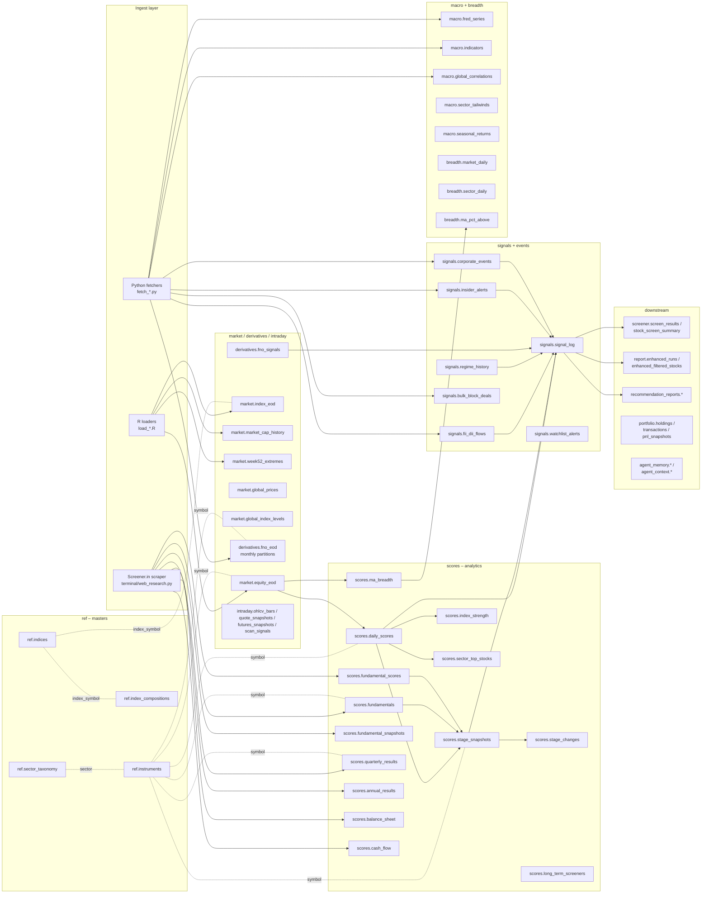

# Unified NSE Analysis — Project Design Document

**Last updated:** 26 May 2026
**Owner:** ShunyaAI-Core (alias Optimus — DEV)
**Repo:** [Unified-NSE-Analysis](README.md)

> A research-grade end-to-end equities + derivatives analysis platform for the Indian markets (NSE), with a chat/REPL agent surface, ~150 tools, ~40 screeners, daily ETL into PostgreSQL, and multi-modal output (HTML reports, voice briefing, email, dashboards). **Strictly educational — not investment advice.**

---

## 1. High-Level Architecture

```
┌─────────────────────────────────────────────────────────────────┐
│         External Data Sources (NSE, FRED, Screener.in, YF)      │
└────────────┬────────────────────────────────────────────────────┘
             │
     ┌───────▼────────┐    ┌─────────────────┐
     │  Fetchers      │    │  R loaders       │
     │  fetch_*.py    │    │  load_*.R        │
     └───────┬────────┘    └────────┬────────┘
             ▼                       ▼
       ┌──────────────────────────────────┐
       │  Caches: CSV / JSON / SQLite     │
       │  (data/, data/_*_cache/)         │
       └──────────────┬───────────────────┘
                      ▼
       ┌──────────────────────────────────┐
       │   PostgreSQL  (nse_market)       │
       │   9 schemas, ~60+ tables          │
       │   market | derivatives | scores  │
       │   signals | breadth   | macro    │
       │   ref     | portfolio | agent_*  │
       └──────────────┬───────────────────┘
                      ▼
       ┌──────────────────────────────────┐
       │  Scoring + Analytical Engines    │
       │  stage, technical, fundamental,  │
       │  breadth, regime, sector rotn,   │
       │  F&O, macro, knowledge graph     │
       └──────────────┬───────────────────┘
                      ▼
       ┌──────────────────────────────────┐
       │  Surfaces                        │
       │  • nse_agent.py  REPL            │
       │  • HTML reports (sector rotn,    │
       │    Apex, Stage-2 tracker, X-Ray) │
       │  • Voice briefing (TTS)          │
       │  • Email daily digest            │
       │  • Backtesting engine            │
       └──────────────────────────────────┘
```

Three runtime regimes coexist:
| Mode | Data plane | Primary use |
|------|------------|-------------|
| **Live / intraday** | NSE live APIs, 15-min candles | `/scan`, `/options`, `/dashboard` |
| **EOD / historical** | PostgreSQL + SQLite + bhavcopy CSV | reports, screeners, backtests |
| **Hybrid** | Auto-detect by keywords | default REPL mode |

---

## 2. Data Sources

### 2.1 PostgreSQL — primary store (`nse_market`)

Connection: socket `/tmp`, user `nse_admin`, no password. Loader: [postgres/loader.py](postgres/loader.py).

| Schema | Theme | Notable tables |
|--------|-------|----------------|
| `ref` | Master / reference | `instruments`, `indices`, `index_compositions`, `sector_taxonomy` |
| `market` | OHLCV / prices | `equity_eod`, `index_eod`, `week52_extremes`, `intraday_snapshots`, `global_prices`, `global_index_levels`, `market_cap_history` |
| `derivatives` | F&O | `fno_eod` (monthly-partitioned), `fno_signals` |
| `scores` | Scoring snapshots | `daily_scores`, `stage_snapshots`, `stage_changes`, `long_term_screeners`, `fundamentals`, `fundamental_snapshots`, `fundamental_section_snapshots`, `fundamental_scores`, `quarterly_results`, `annual_results`, `balance_sheet`, `cash_flow`, `financials_refresh_log`, `ma_breadth`, `index_strength`, `sector_top_stocks` |
| `signals` | Events / flows / alerts | `signal_log`, `fii_dii_flows`, `regime_history`, `bulk_block_deals`, `corporate_events`, `insider_alerts`, `watchlist_alerts` |
| `breadth` | Aggregated breadth | `market_daily`, `sector_daily`, `ma_pct_above` |
| `macro` | Macro / global | `fred_series`, `indicators`, `global_correlations`, `sector_tailwinds`, `seasonal_returns` |
| `portfolio` | User positions | `holdings`, `transactions`, `pnl_snapshots` |
| `agent_memory` / `agent_context` | Agent state | `turn_events`, `session_snapshots`, `active_workflows`, `active_reports`, `pending_options`, `source_trails` |
| `recommendation_reports` | Analyst output | `runs`, `evidence`, `recommendations` |

All time-series tables keyed by `(trade_date, symbol)` or `(snapshot_date, symbol)`; OLTP-friendly upserts via psycopg.

### 2.2 SQLite caches (fallbacks)

| File | Purpose |
|------|---------|
| [data/nse_eod.db](data/nse_eod.db) | Equity EOD fallback for R analysis |
| [data/fno/fno_eod.db](data/fno/fno_eod.db) | Derivatives bhavcopy archive |
| [data/sector_rotation_tracker.db](data/sector_rotation_tracker.db) | Stage + investment scores cache |
| [data/stage_tracker.db](data/stage_tracker.db) | Stage transition history |

### 2.3 Bhavcopy / ingress CSVs

Daily files at repo root, pattern `{code}{DDMMYYYY}.{csv|txt}`:

| Code | Content | Source |
|------|---------|--------|
| `bh*.csv` | Equity EOD (main bhavcopy) — OHLC, vol, turnover, delivery% | NSE archives |
| `bc*.csv` | Bulk / corporate actions | NSE |
| `pr*.csv` | Index EOD | NSE |
| `hl*.csv` | 52-week high / low flags | NSE |
| `mcap*.csv` | Market-cap snapshot | NSE |
| `etf*.csv`, `corpbond*.csv` | ETF + corporate bond quotes | NSE |
| `gl*.csv` | Global indices snapshot | yfinance |
| `an*.txt` | Per-index analysis output | local |
| `bm*.txt` | Market-breadth snapshot | local |

### 2.4 External fetchers (live APIs)

| Script | Source / endpoint | Output |
|--------|-------------------|--------|
| [fetch_fii_dii_flows.py](fetch_fii_dii_flows.py) | NSE `/api/fiidiiTradeReact` | [data/fii_dii_flows.csv](data/fii_dii_flows.csv), `signals.fii_dii_flows` |
| [fetch_fno_data.py](fetch_fno_data.py) | NSE FO UDiFF bhavcopy zip | [data/fno_signals.csv](data/fno_signals.csv), `derivatives.fno_*` |
| [fetch_corporate_events.py](fetch_corporate_events.py) | NSE `/api/corporates-corporateActions`, `/api/event-calendar` | `signals.corporate_events` |
| [fetch_insider_alerts.py](fetch_insider_alerts.py) | NSE archives `bulk.csv`, `block.csv`, `corporates-pit` | `signals.bulk_block_deals`, `signals.insider_alerts` |
| [fetch_macro_proxies.py](fetch_macro_proxies.py) | FRED CSV (DEXINUS, DCOILBRENTEU, PCOPPUSDM, DGS10, INDCPI…), NSE `allIndices` | `macro.*`, [data/macro_proxy_signals.csv](data/macro_proxy_signals.csv) |

Each fetcher uses on-disk JSON cache under `data/_*_cache/` with 18–24 h TTL.

### 2.5 R loaders

| Script | Role |
|--------|------|
| [load_latest_nse_data_comprehensive.R](load_latest_nse_data_comprehensive.R) | Main daily ingest (stocks, indices, breadth, hl, mcap) |
| [load_incr_nse_data_sep3.R](load_incr_nse_data_sep3.R) | Incremental loader variant |
| [_backfill_indices.R](_backfill_indices.R) | Backfill historical index analysis |
| [download_latest_missing_data.R](download_latest_missing_data.R) | Gap-fill |
| [final_data_merge.R](final_data_merge.R) | Consolidate analysis outputs |
| [comprehensive_real_nse_analysis.R](comprehensive_real_nse_analysis.R), [real_nse_analysis.R](real_nse_analysis.R) | Legacy full-stack analysis |
| [enhance_dashboard_with_charts.R](enhance_dashboard_with_charts.R), [report_dashboard_helpers.R](report_dashboard_helpers.R) | Dashboard rendering helpers |

### 2.6 Fundamentals path (Screener.in)

- **Scraper:** `scrape_screener_in()` in [terminal/web_research.py](terminal/web_research.py)
- **Weekly backfill:** [scripts/backfill_screener_fundamentals.py](scripts/backfill_screener_fundamentals.py) — full NIFTY 500, 2.5 s delay + jitter, skip-fresh 7 days
- **Daily targeted refresh:** [scripts/refresh_results_feed.py](scripts/refresh_results_feed.py) — only symbols that filed results in last 14–21 d
- **Tables populated:** `scores.fundamentals`, `fundamental_snapshots`, `fundamental_section_snapshots`, `fundamental_scores`, `quarterly_results`, `annual_results`, `balance_sheet`, `cash_flow`, plus a run log in `scores.financials_refresh_log`

### 2.7 News, events, financial filings

- Corporate actions / earnings calendar → `signals.corporate_events`
- Insider / bulk / block deals → `signals.bulk_block_deals`, `signals.insider_alerts`
- Earnings results (structured) → `scores.quarterly_results`, `scores.annual_results`
- Filings / concalls → [financial_filing_agent.py](financial_filing_agent.py) (XBRL/PDF parse, KPI extraction)
- Unstructured news / web evidence → [company_intelligence_*](company_intelligence.py) suite + [data/company_intelligence/](data/company_intelligence/) SQLite + vector index

---

## 3. Tooling & Capabilities

### 3.1 Agent surface — [nse_agent.py](nse_agent.py)

Interactive REPL with three modes (`/live`, `/eod`, `/auto`) and an LLM cascade (OpenAI → Ollama → keyword router). Headline commands:

| Command | Purpose |
|---------|---------|
| `/dashboard`, `/dash` | Live ticker + sectoral heatmap + narrative |
| `/scan [SYMBOL/INDEX]` | 15-min intraday scanner (ORB, gap-and-go, MACD, VCP, VWAP, RSI div, BB squeeze) |
| `/screen <type>` | Run one of ~40 EOD screeners |
| `/options`, `/fno` | Option chain, PCR, max-pain, IV, OI buildup, greeks |
| `/chart` | Inline price chart with technicals |
| `/search` | Deep search: NSE filings, insider trades, BSE, analyst, concall, social, broker, MF holdings |
| `/news`, `/results`, `/events` | Per-symbol news / earnings / corporate-action lookup |
| `/canslim` | CANSLIM growth check |
| `/forensic` | Accounting red-flags |
| `/cycle` | Macro cycle phase |
| `/scenario` | What-if / stress test |
| `/concall` | Concall sentiment + takeaways |
| `/xray` | Company X-Ray dossier |
| `/strategy_council` | Multi-strategy verdict (Minervini + CAN SLIM + Supertrend + VCP …) |
| `/voice` | 60 s TTS market briefing |
| `/email` | Pipe report to email |
| `/pnl` | Portfolio P&L |
| `/report` | Generate / regenerate research reports |
| `/refresh`, `/doctor`, `/load` | Manual data ops |

Also ships a curated library of **60 prompts in 10 categories** (Market Overview, Intraday, Technicals, Sectors, Screeners, Fundamentals, Stock Deep-Dives, News / Catalysts, Portfolio, Global / Macro).

### 3.2 Planner / router — [terminal/router/](terminal/router/)

`UnifiedRouter` cascades through 9 providers and emits a `RouteDecision` of one of three plan kinds:
- `direct_tool_plan` — fixed tool sequence
- `compound_plan` — multi-symbol workflows
- `fallback_llm` — LLM-driven

Provider chain: `PendingOption` → `ContextualFollowup` → `EntityTopic` → `Report` → `VisualScan` → `MarketSituation` → `TopMovers` → `CompoundStock` → `DirectIntent`. Deterministic keyword intents are preferred (no LLM tax) for `stock_brief`, `screener_inquiry`, `stock_comparison`, `intraday_scan`, `gainers_losers`, `sector_performance`.

### 3.3 Screeners (~40, [terminal/tools.py](terminal/tools.py) + screener modules)

EOD: `stage2`, `momentum_52w`, `high_rs`, `turnaround`, `stage1_base`, `tight_range`, `oversold_bounce`, `breakouts`, `supertrend_buy`, `strong_buy`, `new_entrants`, `new_highs`…

Intraday: `opening_range_breakout`, `gap_and_go`, `macd_crossover`, `rsi_divergence`, `bb_squeeze`, `vwap_reclaim`, `momentum`, `vcp`, `supertrend`, `levels`.

### 3.4 Analytical engines

| Script | Role |
|--------|------|
| [fixed_nse_universe_analysis.py](fixed_nse_universe_analysis.py) | Universe-wide tech + fundamental + RS scoring → `scores.daily_scores` |
| [sector_rotation_tracker.py](sector_rotation_tracker.py) | Stage snapshots + live-price update + Stage-2 HTML tracker |
| [sector_rotation_report.py](sector_rotation_report.py) | Full sector-rotation report + `signal_log.csv` |
| [market_breadth.py](market_breadth.py) | A/D, %>MA, McClellan, TRIN, new highs/lows |
| [regime_detector.py](regime_detector.py) | 4-state HMM regime classifier |
| [economic_cycle.py](economic_cycle.py) | Expansion / late-expansion / slowdown / recovery |
| [global_correlation.py](global_correlation.py), [global_market_intelligence.py](global_market_intelligence.py) | Cross-asset correlation + global context |
| [knowledge_graph.py](knowledge_graph.py) | Shock-propagation graph across promoters / sectors / peers |
| [index_intelligence.py](index_intelligence.py) | Index trend + constituent leadership |
| [apex_resilience_full_report.py](apex_resilience_full_report.py) | CAN SLIM + Minervini + recovery composite report |
| [pullback_recovery_screener.py](pullback_recovery_screener.py) | Stage-2 pullbacks with recovery probability |
| [financial_filing_agent.py](financial_filing_agent.py) | Filing ingestion, XBRL/PDF parse, KPI extraction |
| [company_intelligence.py](company_intelligence.py) + siblings | Company X-Ray, evidence chunking, semantic search |
| [seasonal_heat_calendar.py](seasonal_heat_calendar.py) | 10-year monthly seasonality |

### 3.5 Backtesting — [backtesting/](backtesting/)

Deterministic EOD engine ([engine.py](backtesting/engine.py)), pattern library ([patterns.py](backtesting/patterns.py)), portfolio sizing, PG persistence, ~15-strategy registry (Minervini, CAN SLIM, Supertrend, VCP, MACD, gap-and-go, ORB, RSI mean-revert…). Strategy-council module aggregates multi-strategy verdicts. Per [BACKTESTING_ENGINE_ANALYSIS.md](BACKTESTING_ENGINE_ANALYSIS.md): 1,996 stocks analysed, 161 ≥ 80 % confidence. Metrics: win-rate, return, Sharpe, drawdown, profit factor.

### 3.6 Reports & dashboards

- **Stage 2 Tracker HTML** — `reports/sector_rotation/stage2_tracker_<date>.html` (per-stock detail cards: 5 fund sub-scores, tech score, RSI, trend, signal)
- **Sector Rotation Report** — `reports/sector_rotation/sector_rotation_<date>.html` + Markdown + signal_log.csv
- **Apex Resilience** — HTML/MD/CSV with CAN SLIM + Minervini + recovery + screener.in fundamentals
- **Index / sector dashboards (R)** — [analyze_all_indexes.R](analyze_all_indexes.R), [analyze_all_sectors.R](analyze_all_sectors.R)
- **Market breadth HTML** — [analyze_comprehensive_market_breadth.R](analyze_comprehensive_market_breadth.R)
- **Company X-Ray** — Markdown + HTML dossier per stock
- **Recommendation reports** — `terminal/tools.py::run_recommendation_report()`
- **Voice briefing** — [generate_voice_briefing.py](generate_voice_briefing.py) (60 s; OpenAI TTS or macOS `say`)
- **Email digest** — [email_daily_reports.py](email_daily_reports.py), [email_nse_reports.py](email_nse_reports.py)

### 3.7 Integrations

- **LLM backends:** OpenAI (gpt-4o, tools + vision + TTS), Ollama (local, Granite4 recommended), keyword fallback
- **Voice stack:** `voice_capture / voice_transcribe / voice_command / voice_synth / voice_persona / voice_live / voice_copilot` (OpenAI Whisper / TTS)
- **Email:** Office 365 SMTP via [terminal/email_dispatcher.py](terminal/email_dispatcher.py)
- **Web research:** [terminal/web_research.py](terminal/web_research.py), [terminal/search_engine.py](terminal/search_engine.py), [terminal/youtube.py](terminal/youtube.py)
- **Scheduling:** [com.agentadda.daily_refresh.plist](com.agentadda.daily_refresh.plist) (macOS launchd)

### 3.8 Tests — [tests/](tests/)

~136 test files; pytest. Domain coverage: agent CLI (15), backtesting (5), company intelligence (13), evidence / validation (8), F&O (3), index / screening (5), intraday (3), MTF (4), router / planner (3), reports (7), search / resolution (5), situation assessment (4), terminal tools (12), strategy council (10), voice (4), plus 25+ misc (concurrency, filings, calendar, web search, email, confidence).

---

## 4. Analyses Performed

### 4.1 Weinstein 4-stage classification

Computed in [screeners.py](screeners.py) using SMA50, SMA200, their 10-day slopes, distance-from-52w-high, volume ratio, ATR expansion.

| Stage | Rule (simplified) |
|-------|-------------------|
| 1 — Base | Above SMA200, > 50 bars history, flat SMAs |
| 2 — Markup | Price > SMA50 > SMA200, both sloping up, ≤ 20 % off 52w high |
| 3 — Top | Price > SMA200 but SMA50 slope flattening, ATR expanding |
| 4 — Decline | Price < SMA50 < SMA200, SMA200 sloping down |

Stored in `scores.stage_snapshots` (per symbol per snapshot date) with sub-features; transitions tracked in `scores.stage_changes` (NEW_STAGE2, EXIT_STAGE2, STAGE_UP, STAGE_DOWN…).

### 4.2 Technical score (0–100)

Weighted composite per [fixed_nse_universe_analysis.py](fixed_nse_universe_analysis.py):

| Component | Weight | Inputs |
|-----------|--------|--------|
| RSI(14) | ~30 % | Wilder RSI |
| MACD signal | ~25 % | EMA12 − EMA26, signal EMA9 |
| SMA alignment | ~20 % | Price vs 20 / 50 / 200 |
| Trend momentum | ~15 % | 50-bar ROC |
| ATR | ~10 % | 14 / 60 ATR ratio |

Pattern overlays: consolidation breakout (range ≤ 12 % + vol > 1.4×), Supertrend(10,3), VCP (10/25 ATR ≤ 0.72).

### 4.3 Fundamental scoring — 5 sub-scores

Sourced from Screener.in and cached. Composite `enhanced_fund_score = 0.30·EQ + 0.25·SG + 0.25·FS + 0.20·IB`.

| Sub-score | Drivers |
|-----------|---------|
| `earnings_quality_score` | EPS / earnings growth consistency, margin trend |
| `sales_growth_score` | Revenue CAGR (3y/5y), quarterly consistency |
| `financial_strength_score` | D/E, current ratio, interest coverage (inverse-scaled) |
| `institutional_backing_score` | FII / DII / promoter holding + flows |
| `enhanced_fund_score` | Weighted composite |

Each percentile-normalised 0–100 within a sector / size cohort. Snapshots persisted in `scores.fundamental_scores` and copied into `scores.stage_snapshots` for join-free reporting.

> **Pipeline guard (PG-FUND-ORDER, 26 May 2026):** [daily_refresh.py](daily_refresh.py) now runs `postgres/loader.py --fundamentals-only` *before* the tracker snapshot so all 5 sub-scores render in detail cards. Prior bug: HTML rendered with NULL sub-scores because fundamentals load was deferred to STEP 7.

### 4.4 Market breadth — [market_breadth.py](market_breadth.py)

A/D ratio, % above MA50 / MA200, McClellan oscillator + summation, new 52w highs/lows, TRIN. Persists to [data/breadth_history.csv](data/breadth_history.csv), [data/sector_breadth.csv](data/sector_breadth.csv), `breadth.market_daily`, `breadth.sector_daily`, `breadth.ma_pct_above`.

### 4.5 Regime detection — [regime_detector.py](regime_detector.py)

Gaussian HMM (4 states) on Nifty500 daily features (return, 10d realised vol, 20d ROC, vol ratio). Output regime mutates signal weights downstream:

| Regime | Momentum | Sector RS | Fundamental | Defensive |
|--------|----------|-----------|-------------|-----------|
| BULL_TREND | 1.5× | 1.0× | 1.0× | 0.5× |
| ROTATION | 1.2× | **2.0×** | 1.5× | 1.0× |
| CHOP | 0.4× | 0.8× | 2.0× | 1.5× |
| BEAR_TREND | 0.2× | 0.5× | **2.5×** | 3.0× |

History persisted to `signals.regime_history`.

### 4.6 Sector rotation — [sector_rotation_report.py](sector_rotation_report.py)

Per sector index: RS vs Nifty500 (1m), momentum score (35 % 1m RS + 25 % 1m abs + 20 % 5d RS + 10 % 3m RS + 10 % 6m RS), breadth health (% > MA50/200), composite strength. Rotation signals: `NEW_LEADER`, `MOMENTUM_PEAK`, `BREADTH_BREAKDOWN`, `RS_DIVERGENCE`. Drives candidate ranking + signal_log.csv.

### 4.7 Buy / Sell / Hold signal rules

Cascade evaluated per stock (excerpt):

```text
if tech_score < 30 and RSI < 25                    → AVOID
elif RSI > 75 and MACD<0 and within 2% of 52wH     → SELL
elif volume < 2y median (illiquid)                 → AVOID
elif supertrend BEAR and stage in {3,4}            → WEAK_HOLD / SELL
elif stage=2 and tech>=55 and enhanced_fund>=50    → BUY
elif consolidation_breakout and vol>1.4× and 55<=RSI<=72 → STRONG_BUY
else                                               → HOLD
```

Regime overlay: BULL upgrades BUY→STRONG_BUY when tech>65; CHOP demotes STRONG_BUY→BUY; BEAR enforces fund_score≥60 gate.

### 4.8 F&O analytics — [fetch_fno_data.py](fetch_fno_data.py)

PCR (OI), 5-day OI-buildup %, max-pain strike, buildup classification (long buildup / short buildup / long unwinding / short covering), composite `FNO_SIGNAL` (BULL / BEAR / NEUTRAL). Joined into sector-rotation candidates and exposed via `/options`.

### 4.9 Macro / global context

- **Global correlation:** 30d & 60d rolling vs S&P 500, Nasdaq, Hang Seng, Nikkei, Gold, Brent, Copper, DXY, USDINR. Decoupling alert at |30d−60d| > 20 pp.
- **Macro proxies (FRED + NSE):** USD/INR, Brent crude, Copper, US 10Y, India CPI / rates, India VIX → translated into per-sector tailwind/headwind in `macro.sector_tailwinds`.
- **Economic cycle:** EARLY_EXPANSION / LATE_EXPANSION / SLOWDOWN / RECOVERY; sector preferences adjust fund_score by ±3–4.

### 4.10 Company intelligence

Pipeline: website crawl ([company_website_indexer.py](company_website_indexer.py)) → chunk + embed ([company_intelligence_extract.py](company_intelligence_extract.py)) → semantic search ([company_intelligence_search.py](company_intelligence_search.py)) → evidence synthesis ([company_intelligence_analyze.py](company_intelligence_analyze.py)) → promote to PG ([company_intelligence_promote.py](company_intelligence_promote.py)) → Markdown / HTML X-Ray ([company_intelligence_report.py](company_intelligence_report.py)). Knowledge graph ([knowledge_graph.py](knowledge_graph.py)) models promoter / sector / supply-chain edges for shock propagation.

### 4.11 Voice briefing & email reports

Voice ([generate_voice_briefing.py](generate_voice_briefing.py)): 60 s script (greeting → regime + flows → sector leadership → 3–5 picks → watchlist → sign-off), rendered as `.txt` + `.mp3` (OpenAI) or `.aiff` (macOS `say`). Email ([email_daily_reports.py](email_daily_reports.py)): SMTP Office 365, attaches latest dashboard / screeners / breadth HTML + comprehensive CSV.

### 4.12 Specialty screeners

- **Pullback Recovery** — Stage-2 names with ≤ 30 % peak drawdown, positive RS during pullback, recovery velocity, above SMA50, fund_score ≥ 50. Outputs ranked HTML + optional LLM narrative.
- **Apex Resilience** — Extends pullback recovery with live Screener.in fundamentals (3 quarters), CAN SLIM + Minervini overlays, drawdown / days-since-52wL / recovery-speed composites; emits HTML + MD + CSV + optional Ollama-generated thesis.

---

## 5. Daily Orchestration — [daily_refresh.py](daily_refresh.py)

Triggered ~16:00 IST (post-close) via launchd. Typical wall-clock: ~25 min (33 min with weekly fundamentals backfill).

| Stage | Step | Module |
|-------|------|--------|
| 0 | Download bhavcopy | [load_latest_nse_data_comprehensive.R](load_latest_nse_data_comprehensive.R) |
| 0B | PG EOD load (equity + index) | `postgres/loader.py --eod-only` |
| 1B | PG F&O load + analytics | `postgres/loader.py --fno-only` |
| 1 | Auxiliary fetchers | fetch_fii_dii / fetch_fno / fetch_corp_events / fetch_insider / fetch_macro |
| 2 | Universe analysis | [fixed_nse_universe_analysis.py](fixed_nse_universe_analysis.py) |
| **2B** | **Fundamentals pre-refresh (PG-FUND-ORDER)** | `postgres/loader.py --fundamentals-only` |
| 3 | Tracker snapshot | `sector_rotation_tracker.py --snapshot` |
| 4 | Stage-2 HTML | `sector_rotation_tracker.py --report --html` |
| 5 | Sector rotation report | [sector_rotation_report.py](sector_rotation_report.py) |
| 6 | Voice briefing | [generate_voice_briefing.py](generate_voice_briefing.py) |
| 7 | PG full loader + 40 screeners | `postgres/loader.py` |
| 7a | Results-feed refresh | `scripts/refresh_results_feed.py` |
| 7b | Fundamentals backfill (Sun) | `scripts/backfill_screener_fundamentals.py` |

`--dry-run`, `--live-only`, `--skip-analysis`, `--skip-aux`, `--fundamentals-backfill` flags available.

---

## 6. Quality, Safety, Disclaimers

- **Schema validation** at load time; missing fundamentals → safe defaults (50), missing VIX → 20.
- **Lookback minima** enforced (50 bars SMA50, 200 bars SMA200, 14 bars RSI).
- **Polite scraping**: Screener.in 2.5–3 s delay + jitter, skip-fresh windows.
- **Idempotent upserts**: all PG writes keyed by `(date, symbol)` (or composite); F&O monthly-partitioned.
- **Audit trail**: `scores.financials_refresh_log`, `agent_context.source_trails`, `signals.signal_log`.
- **Tests**: ~136 pytest files spanning agent, screeners, backtest, intelligence, reports, voice.
- **Disclaimer**: Educational research only — *not* investment advice. Users must independently verify and consult SEBI-registered advisers.

---

## 7. Data Model Design

This section documents the **actual PostgreSQL data model** (verified against live `nse_market` on 26 May 2026). 15 schemas, ~70 tables + ~10 views. Time-series tables use natural composite keys `(date, symbol[, …])` and idempotent upserts; one schema is range-partitioned by month (`derivatives.fno_eod`).

### 7.1 Schema map



### 7.2 Reference / master schema (`ref`)

| Table | PK | Key columns | Notes |
|-------|----|-------------|-------|
| [`ref.instruments`](postgres/loader.py) | `symbol` | `isin, company_name, sector, industry, market_cap_cat, is_fno, is_nifty50, is_nifty500, is_etf, is_sme, status, listing_date` | NSE universe master; populated from bhavcopy + NSE securities-info API |
| `ref.indices` | `index_symbol` | `display_name, category_code, is_thematic, is_derivatives, last_close, pe, pb, year_high, year_low` | All NSE indices catalog |
| `ref.index_compositions` | `(index_symbol, symbol, as_of_date)` | `weight_pct` | Index ↔ constituent mapping |
| `ref.sector_taxonomy` | `sector` | `parent_category, nse_index_name, description` | Sector hierarchy used for rollups |

### 7.3 Prices (`market`)

| Table | PK | Important columns | Cardinality |
|-------|----|-------------------|-------------|
| `market.equity_eod` | `(trade_date, symbol, series)` | `open, high, low, close, last_price, prev_close, change_pct, volume, turnover_cr, delivery_pct, week52_high, week52_low, market_cap_cr` | ~2500 sym × ~10y |
| `market.index_eod` | `(trade_date, index_symbol)` | OHLCV + `technical_score, rsi, momentum_50d, relative_strength, trend_signal, trading_signal` | ~100 indices × 10y |
| `market.market_cap_history` | `(snapshot_date, symbol, series)` | `face_value, issue_size, close_price, market_cap_cr` | Sourced from `mcap*.csv` |
| `market.week52_extremes` | `(snapshot_date, symbol)` | `new_high, prev_high, new_low, prev_low, status` | From `hl*.csv` |
| `market.global_prices` | `(trade_date, symbol)` | OHLCV + `source` | yfinance global tickers |
| `market.global_index_levels` | `(trade_date, index_name)` | `close, change_pct` | S&P 500, Nikkei, etc. |
| `market.intraday_snapshots` | `(snapshot_ts, symbol)` | `current_price, change_pct, technical_score, trend_score, momentum_score, volume_score, support_resistance_score, volatility_score, data_points` | Live snapshot during session |

### 7.4 Derivatives (`derivatives`)

`derivatives.fno_eod` is **range-partitioned by `trade_date`**, monthly. Active partitions on 26 May 2026: `fno_eod_y2026m04`, `fno_eod_y2026m05`, plus a `fno_eod_default`.

| Table | PK | Important columns |
|-------|----|-------------------|
| `derivatives.fno_eod` (partitioned) | `(trade_date, symbol, expiry_date, instrument, option_type, strike_key)` | `strike, open/high/low/close, settle_price, prev_close, underlying_price, open_interest, oi_change, volume, turnover_cr, lot_size` |
| `derivatives.fno_signals` | `(snapshot_date, symbol)` | `pcr, oi_change_5d, price_change, buildup, max_pain, fno_signal` |
| `derivatives.fno_scenario_runs` | `scenario_id` | What-if payoff simulator inputs + outputs (`pnl, breakeven, scenario_underlying, move_pct`) |

### 7.5 Intraday (`intraday`)

| Table | Key | Columns of interest |
|-------|-----|---------------------|
| `intraday.ohlcv_bars` | `(symbol, timeframe, timestamp, source)` | 15m / 1h / daily intraday candles; `raw_json` retains provider payload |
| `intraday.quote_snapshots` | `(symbol, source, as_of)` | `last_price, vwap, day_high/low, source_priority[]` |
| `intraday.futures_snapshots` | `(symbol, expiry, source, as_of)` | `underlying, basis, basis_pct, oi, oi_change` |
| `intraday.scan_signals` | `(snapshot_ts, scan_key, symbol, strategy)` | Output of `/scan` — entry/stop/target/RR + 6 sub-scores |

### 7.6 Scoring core (`scores`) — the analytics heart

**Two parallel score families:**

1. **Daily universe score** — `scores.daily_scores` (one row per symbol per day, written by [fixed_nse_universe_analysis.py](fixed_nse_universe_analysis.py))
2. **Stage snapshot + change journal** — `scores.stage_snapshots` (+ `stage_changes` for transitions), written by [sector_rotation_tracker.py](sector_rotation_tracker.py)

| Table | PK | Highlights |
|-------|----|-----------|
| `scores.daily_scores` | `(score_date, symbol)` | `technical_score, rsi, relative_strength, trend_signal, trading_signal, can_slim_score, minervini_score, fundamental_score, enhanced_fund_score, earnings_quality, sales_growth, financial_strength, institutional_backing, change_1d/1w/1m_pct, trading_value, market_cap_cat` |
| `scores.stage_snapshots` | `(snapshot_date, symbol)` | `stage, stage_score, technical_score, rsi, trend_signal, trading_signal, supertrend_state, supertrend_value, can_slim_score, minervini_score, fundamental_score, **enhanced_fund_score, earnings_quality, sales_growth, financial_strength, institutional_backing**, investment_score, stance, narrative, fund_details JSONB, source_csv` |
| `scores.stage_changes` | `(change_date, compare_date, symbol)` | `stage_now, stage_prev, stage_changed, change_type, price_now/prev/chg_pct, live_price, live_vs_prev_pct, stage_score_now/prev, trading_signal` |
| `scores.ma_breadth` | `(snapshot_date, symbol)` | `sma_20/50/100/200, above_20/50/100/200dma, ma_count_above` |
| `scores.long_term_screeners` | `(score_date, symbol)` | Boolean flags: `consolidation_breakout, cup_handle, long_term_uptrend, momentum_breakout, support_bounce, volume_accumulation, earnings_momentum, week52_high_breakout`, `pattern_count` |
| `scores.index_strength` | `(score_date, index_name, symbol)` | Top-5 stocks per index w/ all sub-scores |
| `scores.sector_top_stocks` | `(score_date, sector_name, symbol)` | Top-5 stocks per sector + `sector_strength, total_stocks` |

**Structured fundamentals (Screener.in cache)**

| Table | PK | Columns of interest |
|-------|----|---------------------|
| `scores.fundamentals` | `symbol` | Forensic: `piotroski_score, beneish_m_score, altman_z_score, forensic_risk`; Ratios: `roe, roce, debt_to_equity, promoter_holding`; Growth: `revenue_growth_3y, pat_growth_3y`; raw summaries: `pnl_summary, balance_sheet_summary, cash_flow_summary, investor_summary, ratios_summary` |
| `scores.fundamental_snapshots` | `(snapshot_date, symbol)` | Dated copy of the 6 summaries — feeds the X-Ray report |
| `scores.fundamental_section_snapshots` | `(snapshot_date, symbol, section_name)` | Section-level granularity for retrieval |
| `scores.fundamental_scores` | `(score_date, symbol)` | **The 5 sub-scores** + `processed_date, processing_batch, batch_number, source_file, loaded_at` |
| `scores.quarterly_results` | `(symbol, period_label)` | `period_end, revenue, expenses, operating_profit, opm_pct, other_income, interest, depreciation, pbt, tax_pct, pat, eps, raw_json` |
| `scores.annual_results` | `(symbol, period_label)` | Same as quarterly + `dividend_payout_pct` |
| `scores.balance_sheet` | `(symbol, period_label)` | `equity_capital, reserves, borrowings, other_liabilities, total_liabilities, fixed_assets, cwip, investments, other_assets, total_assets, net_debt` |
| `scores.cash_flow` | `(symbol, period_label)` | `operating_cf, investing_cf, financing_cf, net_cf` |
| `scores.financials_refresh_log` | `run_id` | Job journal: `job_name, started_at, finished_at, symbols_attempted, symbols_loaded, rows_upserted, errors, notes` |

**Convenience views**: `scores.v_latest_quarterly`, `v_latest_annual`, `v_latest_balance_sheet`, `v_latest_cash_flow`, `v_latest_fundamental_scores`, `v_latest_fundamentals` — return the freshest row per symbol for join-free reads.

### 7.7 Signals & events (`signals`)

| Table | PK | Columns |
|-------|----|---------|
| `signals.signal_log` | `id` | Full trade-idea record: `date_issued, symbol, sector, signal, setup_class, investment_score, technical_score, rsi, supertrend_state, price_at_issue, entry_low/high, stop_loss, target_1/2, regime_at_issue, fno_pcr, fno_oi_change_5d, fno_buildup, fno_signal, fii_flow_signal, insider_alert, insider_score, insider_detail, date_resolved, price_at_resolution, return_pct, hit_target, hit_stop, action_bucket, action_reason` — single denormalised row carries the entire trade lifecycle |
| `signals.fii_dii_flows` | `trade_date` | `fii_net_today, dii_net_today, fii_net_5d, dii_net_5d, flow_signal, fii_trend, dii_trend, days_in_window` |
| `signals.regime_history` | `trade_date` | `regime, confidence, days_in_regime` |
| `signals.corporate_events` | `id` (unique `symbol, event_type, event_date`) | `purpose_raw, detail, source` |
| `signals.insider_alerts` | `id` | `alert_date, symbol, alert_type, entity, qty, value_cr, category, detail, insider_score` |
| `signals.bulk_block_deals` | `id` | `deal_date, symbol, entity, side, qty, price, deal_type, remarks` |
| `signals.watchlist_alerts` | `id` | `alert_ts, symbol, alert_type, message, priority, acknowledged, ack_ts` |

View: `signals.v_upcoming_events` — corporate events in the future.

### 7.8 Breadth (`breadth`) and macro (`macro`)

| Table | PK | Columns |
|-------|----|---------|
| `breadth.market_daily` | `trade_date` | `advances, declines, unchanged, adv_volume, dec_volume, net_ad, ad_oscillator, ad_summation, ad_signal, trin, trin_5d, trin_signal, divergence, strong_buy_count, buy_count, hold_count, sell_count, bullish_pct, bearish_pct, avg_technical_score, market_sentiment, nifty500_close` |
| `breadth.sector_daily` | `(snapshot_date, sector)` | `index_name, pct_above_50dma, change_5d, breadth_signal, divergence_alert` |
| `breadth.ma_pct_above` | `snapshot_date` | `pct_above_20/50/100/200dma, stage2_pct` |
| `macro.fred_series` | `(series_id, observation_date)` | Raw FRED series (long-format) |
| `macro.indicators` | `(snapshot_date, indicator)` | Processed: `latest_value, latest_date, trend, momentum_1m_pct, momentum_3m_pct, z_score, signal_score` |
| `macro.global_correlations` | `(snapshot_date, asset)` | `corr_30d, corr_60d, change_pct, alert` |
| `macro.sector_tailwinds` | `(snapshot_date, sector_name)` | `macro_tailwind, macro_detail` |
| `macro.seasonal_returns` | `(symbol, period)` | Monthly seasonality history |

### 7.9 Screener results (`screener`)

| Table | PK | Columns |
|-------|----|---------|
| `screener.screen_definitions` | `screen_id` | `screen_name, category, subcategory, description, rationale, direction, min_score, data_source, sort_col, sort_dir, is_active, tags[]` — registry of all 40 screeners |
| `screener.screen_results` | `(run_date, screen_id, symbol)` | Per-screen hit row: `screen_score, indicator_1/2/3_name+value, investment_score, technical_score, rsi, enhanced_fund_score, can_slim_score, minervini_score, stage, trading_signal, rank_in_screen` |
| `screener.stock_screen_summary` | `(run_date, symbol)` | Per-symbol roll-up: `screens_passed_total, screens_technical/canslim/fundamental/growth/piotroski/macro/composite, conviction_tier, passed_screens[]` |
| `screener.screen_alerts` | `id` | New entrants / exits with `event_type` |

Views: `screener.v_symbol_screens` (long-format symbol × screen), `screener.v_top_conviction` (highest conviction tier ranking).

### 7.10 Reports & recommendations (`report`, `recommendation_reports`)

| Table | PK | Columns |
|-------|----|---------|
| `report.enhanced_runs` | `run_id` | `run_ts, analysis_date, universe_size, stocks_analyzed, stocks_filtered, indices_analyzed, market_composite_score, market_sentiment, notes` |
| `report.enhanced_filtered_stocks` | `(run_id, rank)` | Filtered top stocks per run with all sub-scores + `recommendation` |
| `report.enhanced_indices` | `(run_id, index_name)` | Index-level recommendation rows |
| `recommendation_reports.runs` | `run_id` | `generated_at, as_of, report_path, evidence_path, recommendation_count, market_regime JSONB, source_trail JSONB, missing_evidence JSONB` |
| `recommendation_reports.recommendations` | `(run_id, subject, scope)` | `label (STRONG_BUY..SELL), confidence, score, payload JSONB` |
| `recommendation_reports.evidence` | `(run_id, scope, subject)` | `evidence JSONB` — audit trail per recommendation |

Views: `report.v_latest_run`, `v_latest_filtered_stocks`, `v_latest_indices`.

### 7.11 Portfolio (`portfolio`)

| Table | PK | Columns |
|-------|----|---------|
| `portfolio.holdings` | `id` | `symbol, qty, avg_cost, buy_date, account, notes, created_at, updated_at` |
| `portfolio.transactions` | `id` | `trade_date, symbol, action, qty, price, brokerage, taxes, account, notes` |
| `portfolio.pnl_snapshots` | `(snapshot_date, symbol)` | `qty, avg_cost, current_price, market_value, unrealised_pnl, unrealised_pnl_pct, day_pnl` |

### 7.12 Agent memory (`agent_memory`)

| Table | PK | Columns |
|-------|----|---------|
| `agent_memory.session_snapshots` | `session_id` | `updated_at, turn_count, memory_json JSONB` |
| `agent_memory.turn_events` | `id` | `session_id, turn_index, created_at, user_input, answer, intent, mode, source_label, freshness, result_type, result_summary, symbols[], result_items[], tool_names[], tool_results JSONB, turn_context JSONB` |

(Future-state schemas `agent_context.active_workflows / active_reports / pending_options / source_trails` are planned/scaffolded; not all materialised yet.)

### 7.13 On-demand cache (`on_demand`)

| Table | PK | Columns |
|-------|----|---------|
| `on_demand.eod_price_history` | `(symbol, trade_date)` | Just-in-time history pulls for tickers outside the standard daily universe; `raw_json` preserves provider payload |

### 7.14 Data lifecycle & retention

| Layer | Update cadence | Retention | Idempotency strategy |
|-------|----------------|-----------|----------------------|
| `market.*` | Daily 16:00 IST | Forever (~10y+) | Upsert on `(trade_date, symbol[, series])` |
| `derivatives.fno_eod` | Daily 16:00 IST | Forever; monthly partition | Upsert on PK; partition auto-created |
| `derivatives.fno_signals` | Daily | 90 d typical | Truncate-and-load per `snapshot_date` |
| `scores.daily_scores` | Daily (STEP 2) | Forever | Upsert on `(score_date, symbol)` |
| `scores.stage_snapshots` | Daily (STEP 3) | Forever | Upsert on `(snapshot_date, symbol)` |
| `scores.fundamentals` | On-demand (scrape) | Latest only | Upsert on `symbol`, `updated_at` |
| `scores.fundamental_scores` | After STEP 2B | Forever | Upsert on `(score_date, symbol)` |
| `scores.quarterly_results / annual_results / balance_sheet / cash_flow` | When results filed | Forever | Upsert on `(symbol, period_label)` |
| `signals.fii_dii_flows / regime_history` | Daily | Forever | Upsert on `trade_date` |
| `signals.corporate_events / insider_alerts / bulk_block_deals` | Daily | Forever | Unique-index dedup; INSERT … ON CONFLICT DO NOTHING |
| `signals.signal_log` | When signal fires | Forever | Append-only; `date_resolved` filled later |
| `breadth.* / macro.*` | Daily | Forever | Upsert on natural key |
| `screener.screen_results` | Daily (STEP 7) | 90 d typical | Truncate-and-load per `run_date` |
| `intraday.*` | Live during session | Rolling 60 d | Append; pruned by background job |
| `agent_memory.*` | Per agent turn | Rolling 30 d | Append-only |

### 7.15 Cross-schema relationships (logical)

These are **logical** FKs (not enforced as DB constraints, to keep ingest fast & resilient):

- `<schema>.symbol → ref.instruments.symbol` (in every per-symbol table)
- `ref.index_compositions.index_symbol → ref.indices.index_symbol`
- `ref.index_compositions.symbol → ref.instruments.symbol`
- `ref.instruments.sector → ref.sector_taxonomy.sector`
- `scores.stage_changes.(symbol, change_date) → scores.stage_snapshots.(symbol, snapshot_date)`
- `signals.signal_log.date_issued / symbol` joins to `scores.daily_scores` and `scores.stage_snapshots` for enrichment
- `recommendation_reports.evidence.(run_id) → recommendation_reports.runs.run_id`
- `screener.screen_results.screen_id → screener.screen_definitions.screen_id`
- `derivatives.fno_signals.symbol → ref.instruments.symbol` (where `is_fno = true`)

### 7.16 Indexing strategy

- **Composite PK indexes** on every time-series natural key
- **Per-symbol BRIN / range indexes** on `trade_date` for `market.equity_eod`, `derivatives.fno_eod`
- **Unique indexes** on dedup keys for event tables (e.g. `(symbol, event_type, event_date)` on `signals.corporate_events`)
- **GIN** on `tool_results JSONB`, `raw_json JSONB`, `tags TEXT[]` where searched
- **pg_trgm** for fuzzy `company_name` lookups (used by symbol resolver)

### 7.17 Storage decisions / trade-offs

- **Wide denormalised fact tables** (e.g. `scores.stage_snapshots` carries 30+ columns including all 5 fund sub-scores) — chosen for join-free dashboard reads. Cost: writes carry the full row each day.
- **`raw_json JSONB` retention** on fetchers' tables — preserves provider payload for debugging & reprocessing without re-scraping.
- **Wide signal_log** rather than EAV — captures full lifecycle in one row; trades schema flexibility for analytical simplicity.
- **Monthly partitioning** for F&O only — F&O is the heaviest by row count (~M rows/month); equity EOD is small enough to leave un-partitioned.
- **No FK constraints** — ingest tolerates partial / delayed data; integrity enforced via upserts and a nightly `/doctor` audit.

---

## 8. Glossary of Key Files

| File | One-line role |
|------|---------------|
| [nse_agent.py](nse_agent.py) | REPL entry point + LLM cascade |
| [daily_refresh.py](daily_refresh.py) | Pipeline orchestrator |
| [postgres/loader.py](postgres/loader.py) | All PG upserts + screener runs |
| [sector_rotation_tracker.py](sector_rotation_tracker.py) | Stage snapshots + tracker HTML |
| [sector_rotation_report.py](sector_rotation_report.py) | Sector rotation + signal_log.csv |
| [fixed_nse_universe_analysis.py](fixed_nse_universe_analysis.py) | Universe scoring → `scores.daily_scores` |
| [market_breadth.py](market_breadth.py) | Breadth metrics |
| [regime_detector.py](regime_detector.py) | HMM regime |
| [global_correlation.py](global_correlation.py) | Cross-asset correlation |
| [knowledge_graph.py](knowledge_graph.py) | Shock-propagation graph |
| [company_intelligence.py](company_intelligence.py) | Company X-Ray orchestrator |
| [apex_resilience_full_report.py](apex_resilience_full_report.py) | CAN SLIM + Minervini + recovery report |
| [pullback_recovery_screener.py](pullback_recovery_screener.py) | Stage-2 pullback screener |
| [financial_filing_agent.py](financial_filing_agent.py) | XBRL / PDF filing parser |
| [generate_voice_briefing.py](generate_voice_briefing.py) | 60 s voice briefing |
| [email_daily_reports.py](email_daily_reports.py), [email_nse_reports.py](email_nse_reports.py) | Email digests |
| [backtesting/engine.py](backtesting/engine.py) | EOD backtest engine |

