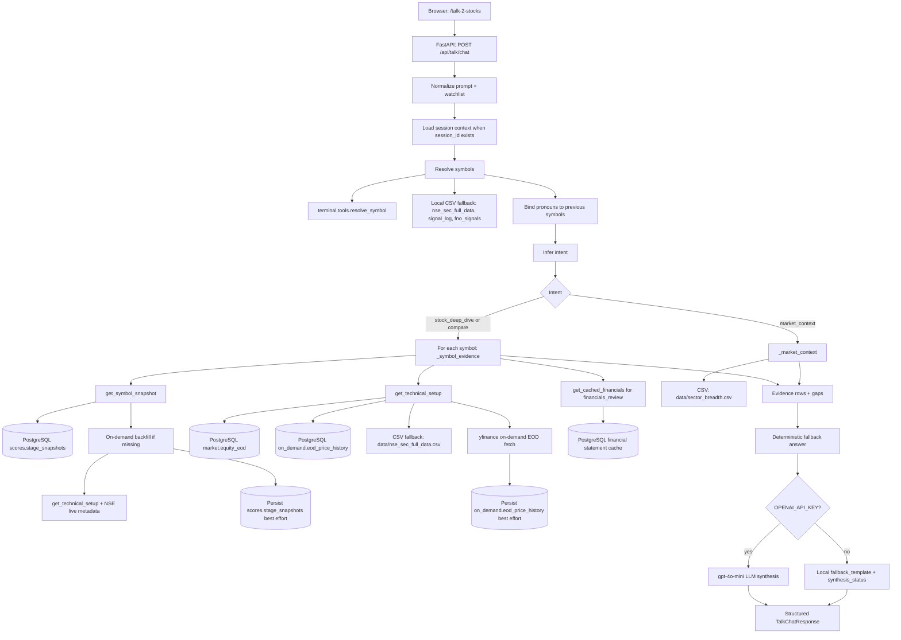
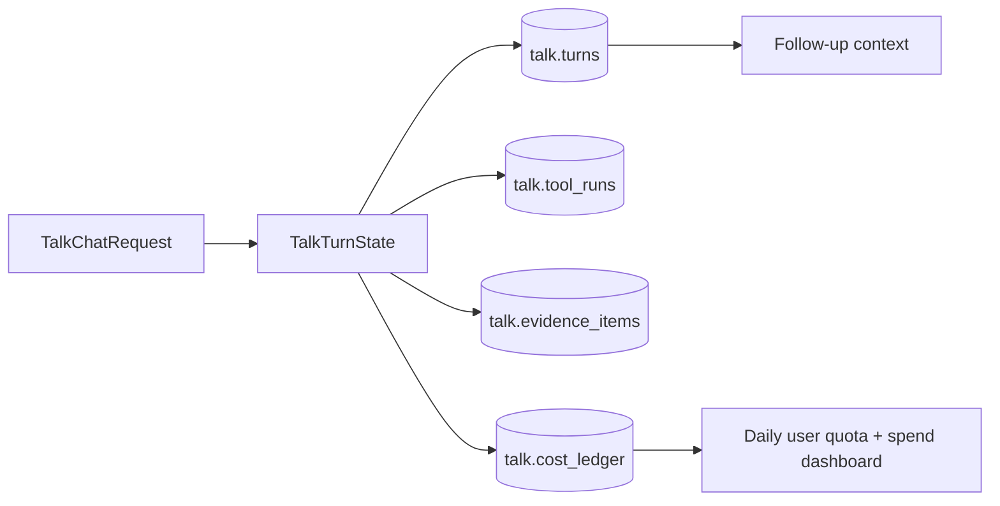

# Talk 2 Stocks Comprehensive Product Design

Date: 2026-08-23
Owner: Agent Adda / Codex
Audience: product, design, and implementation contributors
Status: design-only
Stance: research and learning only; not investment advice

## Product Name

**Talk 2 Stocks**

Recommended lockup:

**Talk 2 Stocks by Agent Adda**

Recommended subtitle:

**Your AI copilot for Indian stock research**

### Why this name

- It is short, memorable, and conversational.
- It communicates the core promise: ask questions, get stock research.
- It scales beyond a single company page into stocks, sectors, indices, portfolios, and filings.
- It is distinct from Screener-style screening language while still sounding familiar to Indian market users.

### Naming principles

- Keep the brand human and conversational.
- Avoid implying recommendations, prediction, or brokerage.
- Keep the name broad enough to cover fundamentals, technicals, sectors, indices, and research workflows.
- Use the Agent Adda brand as the trust and provenance layer.

## Locked Product Decisions

Decisions confirmed on 2026-08-23:

- Talk 2 Stocks will be branded under Agent Adda, not launched as a separate standalone brand in MVP.
- The first product surface should emphasize chat.
- MVP should target a closed beta of 10 users.
- Answers can run in permissive mode for now, provided evidence gaps, stale data, and missing sources are explicit.
- MVP model routing should use OpenAI `gpt-5-nano` for routing, classification, and structured extraction, with OpenAI `gpt-4o-mini` as the everyday answer/synthesis model.
- Model IDs, pricing, and route selection must remain environment-configurable because provider pricing and availability can change.

## One-Line Definition

Talk 2 Stocks is a conversational, evidence-driven research assistant for Indian markets that lets users ask natural-language questions about stocks, sectors, indices, filings, technicals, fundamentals, flows, and catalysts, then answers with a source trail, comparisons, and follow-up actions.

## Product Thesis

Market research is not a single question-answering task. It is a repeated workflow:

1. Identify the object of interest.
2. Resolve the right symbol, sector, or index.
3. Gather fresh evidence.
4. Compare against peers and history.
5. Interpret the signal in context.
6. Decide whether the idea is worth deeper work.

Talk 2 Stocks exists to compress that workflow into a single conversation surface without losing evidence discipline.

## Design Goals

- Make Indian market research feel as easy as chatting with an expert desk.
- Preserve deterministic evidence, freshness checks, and source trails.
- Support both quick answers and deep investigation.
- Bridge company-level research with market-level context.
- Make the assistant feel useful before the user learns any commands.
- Keep the product research-first, not trade-first.

## Non-Goals

- No live brokerage execution.
- No buy/sell recommendations presented as advice.
- No hidden chain-of-thought or unverifiable reasoning.
- No public marketing claims about predictive accuracy.
- No dependence on only one data source or one document type.

## Core User Promise

Users should be able to ask:

- "How is HDFCBANK looking fundamentally and technically?"
- "Is this sector rotating into strength?"
- "Compare TCS vs INFY vs HCLTECH."
- "What changed in NIFTY breadth today?"
- "Summarize the latest concall for RELIANCE."
- "Show me the strongest Stage 2 names with good fundamentals."

And receive:

- a direct answer
- supporting evidence
- a comparison view
- a freshness label
- a next action or follow-up suggestion

## Product Layers

Talk 2 Stocks is designed as three connected layers.

### 1. Core Conversation Layer

This is the natural-language front door.

Primary surfaces:

- `/analyze SYMBOL`
- `/company-xray SYMBOL`
- `/ric sherlock SYMBOL`
- `/ric peer-battle SYMBOL1,SYMBOL2,SYMBOL3`
- `/ric index-pulse INDEX`
- `/ric morning-intel`

User intent handled here:

- company analysis
- peer comparison
- index context
- sector context
- fundamentals
- technicals
- filings
- concalls
- catalysts
- risk review

### 2. Context Layer

This is the evidence and computation engine.

Context sources include:

- fundamentals
- technical indicators
- relative strength
- sector rotation
- index breadth
- FII/DII flows
- corporate events
- insider activity
- results and concalls
- filings and investor documents
- news and catalysts
- forensic signals
- watchlists and alerts

### 3. Product Layer

This is the user-visible experience that makes the assistant feel like a product, not just a command set.

Product surfaces include:

- one clean web chat entry point
- compare mode
- watchlists
- alert subscriptions
- evidence trail and citations
- saved research history
- exportable reports
- report follow-up actions

## LLM Provider, Model Routing, and Cost Architecture

Talk 2 Stocks should be a tool-first product, not an LLM-first product.

The deterministic Agent Adda layer should own:

- symbol resolution
- price and technical calculations
- fundamentals and financial ratios
- sector rotation and breadth
- portfolio facts
- alert triggers
- report generation
- freshness checks

The LLM should own:

- natural-language intent detection
- query decomposition
- JSON extraction for user-created alerts
- synthesis of already-collected evidence
- narrative generation
- follow-up question suggestions
- report explanation in plain language

This split is important for cost, latency, and trust. The LLM should not be asked to rediscover numbers that the system can compute directly.

### Provider Strategy

Recommended default stack:

| Layer | Recommended provider / model | Reason |
|---|---|---|
| Intent routing, alert parsing, classification | OpenAI `gpt-5-nano` | Lowest cost for small structured tasks; good enough when schema and validation are tight. |
| Default stock Q&A and market synthesis for 10-user MVP | OpenAI `gpt-4o-mini` | Lower-cost everyday synthesis model for a closed beta while evidence collection remains deterministic. |
| Later higher-quality synthesis route | Configurable premium OpenAI model | Use only when the task needs deeper reasoning, longer synthesis, or higher answer quality. |
| Batch narrative generation / secondary fallback | DeepSeek V4 Flash | Attractive cost profile for asynchronous report narration and non-critical batch jobs. |
| Indian language, speech, translation, regional UX | Sarvam 105B / Sarvam speech APIs | India-first language and voice layer; useful for Hindi and other Indic workflows. |
| Social/news sentiment experiments | xAI Grok | Keep optional; useful if X-native market context becomes a product requirement, but not cost-efficient as default. |

Grok should not be the default model for core Talk 2 Stocks chat because its per-query cost is materially higher than OpenAI `gpt-4o-mini`, OpenAI Luna, DeepSeek Flash, and Sarvam for the same text workload.

### Cost Assumptions

Working estimate for one standard Talk 2 Stocks answer:

- input: 10,000 tokens
- output: 1,200 tokens
- shape: tool-retrieved market context + concise LLM synthesis
- excludes external data vendor fees, web-search tool fees, storage, compute, email, and voice
- INR conversion assumption: ~₹95.66 per USD on 2026-08-23

This is intentionally conservative for normal Q&A. Full deep-research reports should be budgeted separately.

### Current API Cost Snapshot

Pricing snapshot researched on 2026-08-23 from provider pricing pages.

| Provider / model | Input / 1M tokens | Output / 1M tokens | Approx. cost / 1,000 standard queries | Fit |
|---|---:|---:|---:|---|
| OpenAI `gpt-5-nano` | $0.05 | $0.40 | ~$0.98 / ₹94 | Routing, alert parsing, extraction |
| OpenAI `gpt-4o-mini` | $0.15 | $0.60 | ~$2.22 / ₹212 | MVP default chat synthesis |
| OpenAI `gpt-5.6-luna` | $0.20 | $1.20 | ~$3.44 / ₹329 | Default assistant |
| OpenAI `gpt-5-mini` | $0.25 | $2.00 | ~$4.90 / ₹469 | Legacy/simple fallback |
| DeepSeek V4 Flash, off-peak | $0.22 | $0.66 | ~$2.99 / ₹286 | Batch/default-cost fallback |
| DeepSeek V4 Flash, peak | $0.44 | $1.32 | ~$5.98 / ₹572 | Peak DeepSeek usage |
| Sarvam 105B | ₹29.28 | ₹73.20 | ~₹381 | India-first language layer |
| xAI Grok 4.3 | $1.25 | $2.50 | ~$15.50 / ₹1,483 | Optional social/news reasoning |
| xAI Grok 4.6 | $2.00 | $6.00 | ~$27.20 / ₹2,602 | Premium Grok; not default-cost viable |

### Monthly Cost Envelope

For standard text queries using the 10k input / 1.2k output assumption:

| Usage level | Monthly queries | OpenAI `gpt-4o-mini` | OpenAI `gpt-5.6-luna` | DeepSeek V4 Flash off-peak | Sarvam 105B | xAI Grok 4.6 |
|---|---:|---:|---:|---:|---:|---:|
| Internal / personal | 2,200 | ~$4.88 / ₹467 | ~$7.57 / ₹724 | ~$6.58 / ₹630 | ~₹837 | ~₹5,724 |
| Active community | 22,000 | ~$48.84 / ₹4,672 | ~$75.68 / ₹7,240 | ~$65.82 / ₹6,297 | ~₹8,374 | ~₹57,243 |
| Heavy public | 220,000 | ~$488.40 / ₹46,721 | ~$756.80 / ₹72,395 | ~$658.24 / ₹62,967 | ~₹83,741 | ~₹5.72L |

### Deep Research Cost Envelope

Working estimate for 1,000 deep-research report syntheses:

- input: 50,000 tokens each
- output: 4,000 tokens each
- total: 50M input tokens + 4M output tokens

| Model | Approx. cost / 1,000 deep reports |
|---|---:|
| OpenAI `gpt-4o-mini` | ~$9.90 / ₹947 |
| DeepSeek V4 Flash off-peak | ~$13.64 / ₹1,305 |
| OpenAI `gpt-5.6-luna` | ~$14.80 / ₹1,416 |
| OpenAI `gpt-5-mini` | ~$20.50 / ₹1,961 |
| Sarvam 105B | ~₹1,757 |
| xAI Grok 4.6 | ~$124 / ₹11,862 |

Deep research should not automatically use the most expensive model. The system should first assemble deterministic evidence, then escalate only the final synthesis or conflict-resolution step.

### Recommended Runtime Defaults

Recommended environment configuration:

```text
LLM_ROUTER_PROVIDER=openai
LLM_ROUTER_MODEL=gpt-5-nano

LLM_DEFAULT_PROVIDER=openai
LLM_DEFAULT_MODEL=gpt-4o-mini

LLM_RESEARCH_PROVIDER=openai
LLM_RESEARCH_MODEL=gpt-4o-mini

LLM_BATCH_PROVIDER=deepseek
LLM_BATCH_MODEL=deepseek-v4-flash

LLM_INDIC_PROVIDER=sarvam
LLM_INDIC_MODEL=sarvam-105b
```

### Model Routing Rules

| Task | Default model route | Notes |
|---|---|---|
| Symbol/entity resolution | deterministic first, then `gpt-5-nano` | Use LLM only for ambiguous natural language. |
| Alert command parsing | `gpt-5-nano` | Must return strict JSON and fall back to positional parser. |
| Quick stock answer | `gpt-4o-mini` | Use compact evidence pack, not full raw tables. |
| Sector/index summary | `gpt-4o-mini` | Deterministic breadth and sector data first. |
| Peer comparison | `gpt-4o-mini`; escalate only after MVP | Keep comparison matrix deterministic. |
| Full company research report | `gpt-4o-mini` for MVP synthesis only | Evidence gathering must remain deterministic and cited; gaps are allowed if explicit. |
| Bulk nightly narratives | DeepSeek V4 Flash or OpenAI batch | Accept asynchronous latency for lower cost. |
| Hindi/regional explanation | Sarvam | Use as presentation layer over the same evidence. |
| Voice briefing | Sarvam or OpenAI TTS | Keep separate from text reasoning budget. |

### Cost Controls

Required product controls:

- per-call token logging
- per-feature monthly budget caps
- model route recorded in every generated report
- prompt-cache friendly system prompts
- small evidence packs instead of dumping entire reports into context
- deterministic fallbacks for routing and alerts
- batch mode for nightly narratives
- explicit escalation from default model to research model
- cost dashboard by feature, model, and user/session

### Implementation Implications

The current codebase should avoid hardcoded model names such as `gpt-4o-mini` and `gpt-4o`.

Required implementation changes:

1. Add a provider abstraction for OpenAI-compatible chat APIs.
2. Support provider-specific base URLs for OpenAI, DeepSeek, and xAI.
3. Keep Sarvam as a separate adapter for Indic language and speech APIs.
4. Move model names into environment configuration.
5. Update local pricing tables with provider, model, input, cached-input, and output rates.
6. Log actual token usage and estimated cost for every LLM call.
7. Add task-level routing so cheap extraction calls never use the default synthesis model.
8. Add a monthly spend report for Talk 2 Stocks.

## MVP Chat Engine Design

Talk 2 Stocks should ship its MVP as a bounded Agent Adda engine, not as an unconstrained LLM chat wrapper.

The local web MVP currently has a simplified deterministic-first route in `agent_adda/web_api/routes/talk.py`:

```text
user input
 -> symbol resolution
 -> simple intent detection
 -> fixed evidence fetch
 -> deterministic draft
 -> optional LLM synthesis
 -> structured UI response
```

Current route behavior:

1. User submits a prompt from `/talk-2-stocks`.
2. FastAPI receives `POST /api/talk/chat`.
3. The route loads lightweight session context when `session_id` is present.
4. `_resolve_query_symbols()` extracts symbols from text and watchlist context, validates them with `terminal.tools.resolve_symbol`, and falls back to local NSE CSVs where needed.
5. Context binding resolves pronouns such as "it", "this", or "previous" to the prior turn's symbols before tools run.
6. `_infer_intent()` performs lightweight intent detection across:
   - `watchlist`
   - `compare`
   - `market_context`
   - `stock_deep_dive`
   - `financials_review`
   - `evidence_review`
   - `advice_boundary`
   - `general_research`
7. The route gathers evidence through:
   - `get_symbol_snapshot`
   - `get_technical_setup`
   - `get_cached_financials` for financial follow-ups
   - `data/sector_breadth.csv`
8. The route records explicit evidence gaps instead of hiding missing or stale data.
9. `_fallback_answer()` creates a deterministic answer.
10. `_llm_synthesis()` uses `LLM_DEFAULT_MODEL`, defaulting to `gpt-4o-mini`, as the preferred MVP synthesis path when `OPENAI_API_KEY` is configured.
11. The response returns answer, symbols, comparison rows, market context, evidence, gaps, next actions, token/cost metadata, and model route.

Important MVP gap:

- `gpt-5-nano` is currently exposed as the router model in defaults/model metadata, but the web MVP does not yet use an LLM router. Current routing is still deterministic Python logic.

### Target MVP Engine

For the 10-user Agent Adda beta, the web engine should be promoted to a bounded agent loop:

```text
TalkTurnState
 -> nano JSON router
 -> validated intent
 -> fixed tool plan
 -> execute Agent Adda tools
 -> gpt-4o-mini synthesis
 -> evidence/gap/cost response
 -> persist session + audit trail
```

Design principles:

- Do not expose raw LLM tool calls to the web product.
- Use `gpt-5-nano` only for small structured tasks: route selection, entity extraction, clarification choice, and alert parsing.
- Map every approved route to deterministic tool plans owned by Agent Adda code.
- Use `gpt-4o-mini` for normal answer synthesis over already-collected evidence.
- Keep deterministic fallback answers available when LLM synthesis fails.
- Treat gaps, stale data, and source limits as first-class response fields.
- Persist enough turn state to support follow-up questions, quota, debugging, and cost review.

### TalkTurnState

Each chat request should build and persist a compact turn state:

```text
session_id
user_id or beta_user_id
raw_input
normalized_input
watchlist_context
resolved_symbols
intent
route_confidence
clarification_state
tool_plan
tool_results_summary
evidence_items
gaps
model_route
input_tokens
output_tokens
cost_usd
answer
created_at
```

The web MVP can start with SQLite or local JSONL for the closed beta, but the contract should be compatible with PostgreSQL.

### Situation Assessment

The web engine should borrow the mature terminal agent pattern:

- decide whether the user is asking a new question or referring to prior context
- answer from context only when the previous turn already contains enough evidence
- ask a clarification when the symbol, time horizon, or comparison set is ambiguous
- run a tool plan when fresh evidence is needed
- fall back to deterministic routing when the LLM router is uncertain

The terminal implementation already has this shape in `terminal/agent.py`, `terminal/llm_situation_assessment.py`, and `terminal/semantic_intent.py`. The MVP should reuse the principle, not directly expose the entire terminal command surface.

### Intent Detection

MVP allowed intents should be deliberately small:

| Intent | Purpose | Default tool plan |
|---|---|---|
| `stock_deep_dive` | one-stock research answer | resolve symbol, snapshot, technical setup, sector context |
| `compare` | 2-5 stock comparison | resolve symbols, snapshot/technicals for each, comparison matrix |
| `market_context` | index/sector/breadth read | market breadth, index snapshot, sector breadth |
| `watchlist` | save or review user symbols | resolve symbols, lightweight snapshots |
| `clarification` | disambiguate symbol/scope/horizon | no research tools until user chooses |
| `financials_review` | revenue, sales, PAT, EPS, results follow-up | resolve symbol, snapshot, technical setup, cached financials |
| `evidence_review` | explain gaps, sources, freshness, or evidence used | answer from prior turn evidence; no fresh research unless needed |
| `advice_boundary` | buy/sell/recommendation-style prompt | refuse advice, give research-only evidence and next checks |
| `general_research` | educational or broad market question | market knowledge/search or deterministic fallback |

Router output must be strict JSON and validated before execution:

```json
{
  "intent": "compare",
  "confidence": 0.86,
  "symbols": ["TCS", "INFY", "HCLTECH"],
  "horizon": "swing",
  "needs_clarification": false,
  "clarification_question": "",
  "tool_plan_id": "compare_v1"
}
```

If validation fails or confidence is below threshold, the engine should use deterministic routing or ask a clarification.

### Agent Loop

The MVP loop should be bounded to one planned execution pass:

1. Build `TalkTurnState`.
2. Run deterministic pre-processing: clean input, detect obvious symbols, attach watchlist.
3. Run `gpt-5-nano` router only when deterministic routing is insufficient.
4. Validate intent, symbols, horizon, and tool plan id.
5. Execute the fixed Agent Adda tool plan.
6. Normalize tool outputs into evidence items, compact summaries, and gaps.
7. Generate deterministic fallback answer.
8. Run `gpt-4o-mini` synthesis over compact evidence when available.
9. Apply response guardrails: research-only, no fabricated values, gaps visible.
10. Persist turn state and return structured response to the UI.

No unbounded reflection loop is required for MVP. Deeper multi-step research can be introduced after the 10-user beta has cost and quality telemetry.

### Tool Layer

The web MVP starts with a small tool surface:

```text
resolve_symbol
get_symbol_snapshot
get_technical_setup
sector_breadth.csv
OpenAI synthesis, optional
```

The target MVP can add selected mature Agent Adda tools:

```text
compare_stocks
get_market_breadth
get_index_snapshot
get_live_market_overview
get_sector_context
get_cached_financials
scrape_screener_in
get_latest_results
search_nse_announcements
search_bse_filings
run_screener_query
```

Every tool must return a normalized evidence record or an explicit gap. Tool exceptions should not crash the chat response unless the request cannot be interpreted at all.

### Data Flow and Database Fetching

Current MVP fetch path:



Current source priorities:

| Evidence need | Current code path | Primary source | Fallbacks |
|---|---|---|---|
| Symbol validation | `_resolve_query_symbols()` | `terminal.tools.resolve_symbol` | local CSV symbol scan |
| Stock snapshot | `get_symbol_snapshot()` | `scores.stage_snapshots` latest `snapshot_date` | on-demand technical backfill; optional legacy SQLite only when enabled |
| Price history for technicals | `get_technical_setup()` | `market.equity_eod` | `on_demand.eod_price_history`, yfinance on-demand fetch, `data/nse_sec_full_data.csv` |
| Cached financials | `get_cached_financials()` | PostgreSQL financial statement cache | explicit missing financials gap |
| Sector breadth in current web MVP | `_market_context()` | `data/sector_breadth.csv` | explicit `sector_breadth.csv missing` gap |
| Index snapshot, later MVP | `get_index_snapshot()` | `data/nse_index_data.csv` | explicit missing/error response |
| Market breadth, later MVP | `get_market_breadth()` | `scores.stage_snapshots` plus optional `ref.index_compositions` | local index constituents; optional legacy SQLite only when enabled |

Database connection rules:

- The tool layer uses `AGENT_ADDA_PG_DSN`, then `PG_DSN`, then `dbname=nse_market user=nse_admin host=/tmp`.
- `agent_adda/web_api/main.py` loads the repo `.env`, then the parent workspace `.env`, filling only missing keys. This allows the API to pick up `OPENAI_API_KEY` from the shared finance workspace while preserving explicit shell overrides.
- Legacy SQLite fallback is disabled by default and only used when `AGENT_ADDA_ENABLE_SQLITE_FALLBACKS` is truthy.
- On-demand fetches are best-effort. If a symbol lacks normal EOD history, technical setup may fetch EOD bars on demand and persist them into `on_demand.eod_price_history`.
- If a stage snapshot is missing but technical data exists, the tool can create a technical-only stage snapshot and persist it into `scores.stage_snapshots` best effort. Fundamental/CANSLIM/Minervini fields remain explicit gaps.

Target MVP persistence:



Target tables can start as SQLite or JSONL for local beta, but production beta should use PostgreSQL:

| Table | Purpose |
|---|---|
| `talk.sessions` | beta user/session identity, created/last-seen timestamps |
| `talk.turns` | raw input, normalized input, intent, symbols, answer, mode |
| `talk.tool_runs` | tool name, args, status, latency, compact result summary, error |
| `talk.evidence_items` | normalized evidence label, source, as-of date, value JSON |
| `talk.cost_ledger` | router/synthesis model, token counts, estimated cost, user/session |

This gives the product a durable audit trail without changing the evidence stores that already power Agent Adda.

### Output Synthesis Contract

Every response should include:

- direct answer
- intent
- resolved symbols
- evidence list
- gaps
- freshness labels
- comparison rows or market rows when applicable
- next actions
- model route
- token/cost metadata
- research-only disclaimer

The UI should render evidence and gaps separately from the prose answer so beta users can quickly inspect what the assistant actually used.

## Primary Use Cases

### A. Stock Deep Dive

The user wants a full view of one stock.

Expected output:

- current price context
- technical summary
- fundamental summary
- sector context
- peer comparison
- news and filings summary
- risk flags
- evidence gaps
- follow-up prompts

### B. Peer Comparison

The user wants to compare two or more stocks.

Expected output:

- side-by-side scorecard
- valuation and quality deltas
- technical stage comparison
- relative strength ranking
- moat or business-model differences
- verdict by use case

### C. Sector / Index Intelligence

The user wants to know what is happening in the broader market.

Expected output:

- sector leaders and laggards
- breadth regime
- index trend
- participation quality
- FII/DII read-through
- candidate stocks in the strongest sectors

### D. Filing / Concall Research

The user wants document-grounded answers.

Expected output:

- extract key facts
- summarize management commentary
- flag risks and open questions
- connect filings to valuation or setup changes

### E. Watchlist Management

The user wants to track a set of names over time.

Expected output:

- alerts for stage changes
- alerts for major technical breaks
- alerts for corporate events
- alerts for results and concall updates
- historical trace of why the name is being watched

## Information Architecture

### Entry Points

The product should expose four obvious entry points:

1. `Ask about a stock`
2. `Compare stocks`
3. `Explore a sector or index`
4. `Track my watchlist`

### Navigation Model

Recommended top-level tabs:

- Chat
- Compare
- Watchlist
- Reports
- Alerts
- Evidence

### Progressive Disclosure

The UI should not dump every data point at once.

Recommended order:

1. Answer the question.
2. Show the top 3 reasons.
3. Show charts or tables.
4. Show source trail.
5. Show follow-up actions.

## Conversation Design

### Default Behavior

The assistant should infer intent from the question and then choose the correct workflow.

Examples:

- "How is RELIANCE doing?" → stock deep dive
- "Compare TCS and INFY" → peer battle
- "What sectors are strong today?" → sector context
- "Is NIFTY healthy?" → index pulse
- "Summarize the latest concall" → document analysis

### Clarification Behavior

Ask a clarifying question only when needed.

Examples:

- multiple symbols with ambiguous comparison objective
- user asks for "best" without a criterion
- document sources conflict materially
- stale or missing freshness on a high-stakes request

### Response Pattern

Recommended answer structure:

1. Direct answer
2. Evidence-backed reasons
3. Relevant comparison or context
4. Risks / caveats
5. Suggested next question

## Core Workflows

### 1. `/analyze` Workflow

Purpose:

- One-stop 360 degree analysis for a symbol or document.

Expected steps:

1. Resolve input type.
2. Fetch technicals.
3. Fetch fundamentals.
4. Fetch forensic and quality checks.
5. Fetch news and catalysts.
6. Fetch sector and peer context.
7. Produce a unified summary.

### 2. `/company-xray` Workflow

Purpose:

- Build a company-anchored evidence map.

Expected steps:

1. Resolve the company.
2. Collect official evidence.
3. Index company website and investor relations material.
4. Map sector and competitors.
5. Map policy and macro sensitivity.
6. Separate evidence from interpretation.
7. Publish a strict or permissive report.

### 3. `/ric sherlock`

Purpose:

- A reusable stock investigation recipe.

Expected steps:

1. Quote or latest price
2. Technical setup
3. Fundamentals
4. News and catalysts
5. Trade or watchlist conclusion

### 4. `/ric peer-battle`

Purpose:

- Multi-stock comparison and verdict.

Expected steps:

1. Compare fundamentals
2. Compare technicals
3. Compare catalysts
4. Render a verdict by user objective

### 5. `/ric index-pulse`

Purpose:

- Index + breadth + top stock context.

Expected steps:

1. Index technicals
2. Breadth
3. Leaders and laggards
4. Intraday or EOD implications

### 6. `/ric morning-intel`

Purpose:

- Daily market briefing.

Expected steps:

1. Global cues
2. Yesterday recap
3. Breadth
4. FII/DII
5. Watchlist ideas

## Evidence Model

The product should not mix facts and opinions.

### Evidence Tiers

Tier 1:

- official filings
- annual reports
- concalls
- company IR pages
- exchange announcements

Tier 2:

- internal fundamentals
- technicals
- sector data
- breadth
- FII/DII
- historical price behavior

Tier 3:

- news
- broker commentary
- third-party context

Tier 4:

- LLM interpretation

### Evidence Rules

- Every strong claim should trace back to a fact or source trail.
- Gaps should be explicit.
- Stale inputs should be labeled.
- Conflicting evidence should be surfaced, not hidden.

## Product Features

### 1. Universal Search

Search anywhere across:

- stocks
- sectors
- indices
- documents
- reports
- alerts
- watchlists

### 2. Compare Mode

Side-by-side research for 2 to 10 symbols.

Should support:

- valuation
- quality
- growth
- technical stage
- relative strength
- catalyst summary
- risk summary

### 3. Watchlists

Support multiple named watchlists such as:

- personal core
- long-term compounders
- momentum
- event-driven
- sector rotation
- post-earnings

### 4. Alerts

Alert types:

- price moves
- RSI thresholds
- stage changes
- breakout confirmation
- volume surges
- event filings
- results updates
- concall publication

### 5. Evidence Trail

Each answer should expose:

- fresh data timestamp
- sources used
- missing data
- confidence or confidence proxy
- whether the answer is derived or directly sourced

### 6. Export and Share

Allow export of:

- chat summary
- comparison table
- watchlist report
- evidence trail
- markdown or HTML report

### 7. Research History

Users should be able to revisit:

- prior questions
- saved symbols
- recent comparisons
- prior rationale
- previous evidence versions

## UX Principles

- Fast answer first.
- Evidence second.
- Charts and tables only when useful.
- Never force users to learn commands before they get value.
- Never pretend certainty when evidence is incomplete.
- Prefer legible, minimal, high-contrast research UI.
- Make it easy to move from chat to comparison to saved watchlist.

## Web App Design

### Home Screen

The home screen should feel like a research command center.

Recommended elements:

- big conversational prompt
- quick chips for stock / compare / sector / index / watchlist
- recent sessions
- top market context
- saved watchlists
- latest reports

### Stock Page

Each stock page should contain:

- chat panel
- summary card
- technical card
- fundamental card
- peer card
- filing card
- alert state
- evidence panel

### Compare Page

The compare page should contain:

- search inputs for 2 to 10 symbols
- comparison matrix
- score breakdown
- value vs quality vs momentum split
- verdict by use case

### Sector / Index Page

The sector/index page should contain:

- trend
- breadth
- leadership
- laggards
- flow context
- strongest constituent names

### Watchlist Page

The watchlist page should contain:

- holdings or tracked names
- freshness status
- current signal state
- recent alerts
- reason for tracking

## Command and Product Alignment

The product should not invent a new mental model that conflicts with the existing terminal.

Recommended mapping:

- Chat product = `/analyze` + `/company-xray`
- Deep investigation = `/ric sherlock` + `/ric company-xray`
- Peer compare = `/ric peer-battle`
- Market context = `/ric index-pulse` + `/ric morning-intel`
- Alerts = `/monitor` + `/alert`
- Reports = `/report`

This keeps the web and terminal experiences consistent.

## What Makes It Different From Screener AI

Screener AI is mainly company-document chat with direct access to official documents.

Talk 2 Stocks should be broader:

- company documents
- technicals
- sectors
- indices
- breadth
- flows
- alerts
- watchlists
- research reports

The differentiator is not just answer quality. It is breadth plus workflow.

## What Makes It Credible

The product should show:

- source trail
- freshness labels
- peer context
- clear disclaimers
- explicit data gaps
- deterministic reports alongside LLM summaries

Credibility comes from evidence discipline, not from sounding confident.

## Suggested MVP Scope

### MVP 1

Audience:

- closed beta for 10 users
- branded under Agent Adda
- chat-first product entry
- permissive answers with explicit evidence gaps

Core surface:

- one web chat entry point
- bounded `TalkTurnState` chat engine
- `gpt-5-nano` JSON router for validated routing and extraction
- fixed Agent Adda tool plans, not raw LLM tool calls
- symbol resolution
- stock deep dive
- compare 2-3 stocks
- sector and index context
- evidence trail
- watchlist save
- basic alerts

### MVP 2

- richer peer comparison
- filing and concall ingestion
- report history
- compare mode for larger baskets
- user-session memory
- export/share

### MVP 3

- portfolio link-in
- alert subscriptions
- multi-watchlist support
- report packs
- richer evidence provenance UI

## Quality Bars

The product is complete only if it can answer these questions reliably:

- What is the user asking for?
- What evidence supports the answer?
- What is stale or missing?
- What is the relevant peer or market context?
- What should the user do next?

## Research-Only Disclaimer

Talk 2 Stocks is a research and learning tool.
It is not investment advice, not a trading recommendation engine, and not a substitute for professional judgement, compliance review, or risk management.

## Suggested Repo Integration

Canonical artifacts for this product should live under:

- `docs/superpowers/specs/`
- `reports/talk_2_stocks/`
- `terminal/` for command and routing integration
- `agent_adda/web_api/` or a dedicated frontend surface for web chat

Deployment design:

- `docs/superpowers/specs/2026-08-23-talk-2-stocks-agentadda-deployment-design.md`
- local MVP: `agent_adda/web_api/static/talk_2_stocks.html`
- AgentAdda.in shell: `agentadda/www` route for `/talk-2-stocks`
- production API: FastAPI service exposing `/api/talk/*`

## Open Questions

Resolved for MVP:

1. Talk 2 Stocks is a branded surface under Agent Adda.
2. The default landing page should emphasize chat.
3. The first release targets a 10-user closed beta.
4. The assistant should default to permissive answers for now, with explicit evidence gaps and stale-data labels.

Still open after MVP:

1. When should strict evidence mode become mandatory?
2. Which beta-user workflow deserves the second tab priority after chat: compare or watchlist?
3. When should the model route escalate beyond `gpt-4o-mini` for deep synthesis?
4. Should Agent Adda expose subscription tiers during beta or keep access manually managed?

## Proposed Next Step

Build the web product as an Agent Adda-branded 10-user MVP around three tabs:

1. Chat
2. Compare
3. Watchlist

Chat is the first-viewport priority. Compare and Watchlist should be available as secondary workflows, with an evidence side panel and lightweight report export path added after the chat loop works end to end.
