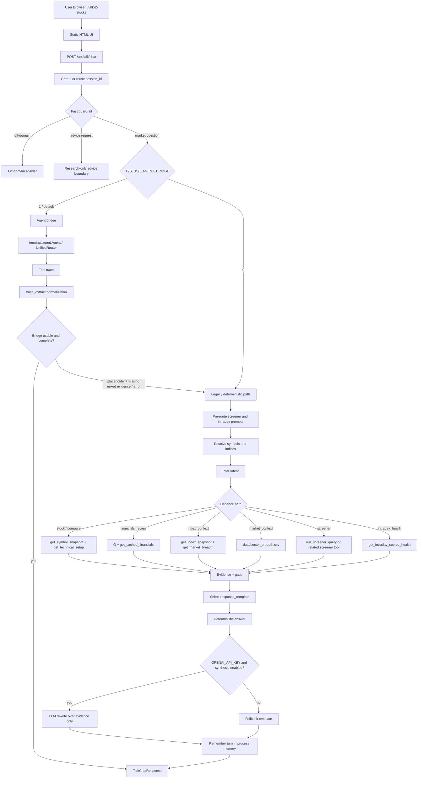
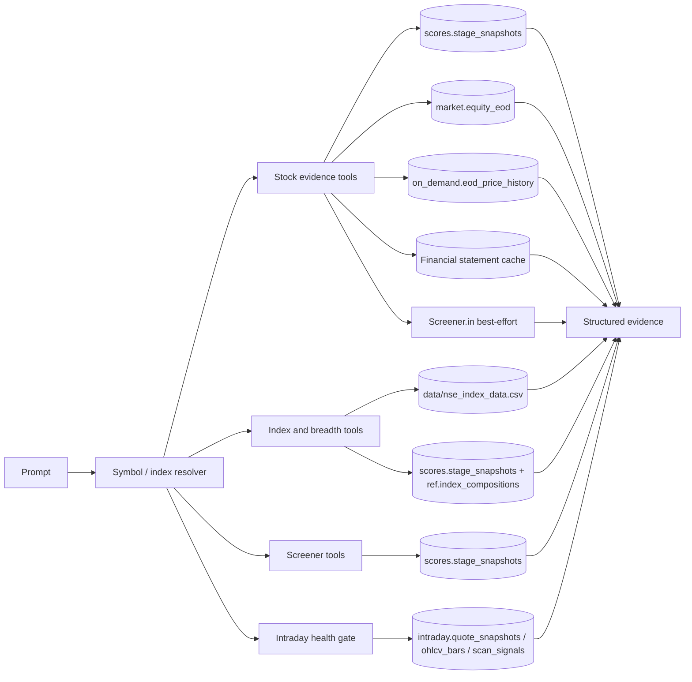

# Talk 2 Stocks Tech Design and Backlog

Prepared for: Nirmal  
Prepared on: 2026-08-24  
System: Agent Adda / Unified-NSE-Analysis

## 1. Executive Summary

Talk 2 Stocks is the Agent Adda web research surface for natural-language Indian market questions. It is served locally by FastAPI at `/talk-2-stocks` and backed by Agent Adda's existing terminal tools for symbol resolution, stock snapshots, technical analysis, financials, screeners, index breadth, intraday source health, and RIC analysis.

The current product is an MVP-plus implementation. It already supports chat, compare, screener/watchlist flows, index context, financial-results tables, technical summaries, evidence/gap panels, response templates, and a bridge into the mature terminal-agent pipeline. The next build phase should harden this into a closed-beta product: durable session/audit storage, production deployment, stronger source freshness, more complete intraday behavior, and systematic UI quality checks.

## 2. Current Code Map

| Area | File | Responsibility |
|---|---|---|
| FastAPI app | `agent_adda/web_api/main.py` | Mounts all API routers and serves `/talk-2-stocks` static HTML. |
| Talk API | `agent_adda/web_api/routes/talk.py` | Main T2S route logic: bridge selection, deterministic routing, symbol resolution, evidence collection, response templating, session memory. |
| Request/response schemas | `agent_adda/web_api/schemas.py` | `TalkChatRequest`, `TalkChatResponse`, evidence, action, compare, screener contracts. |
| Agent bridge | `agent_adda/web_api/bridge.py` | Runs `terminal.agent.Agent` per browser session with isolated memory and PG writes disabled. |
| Trace extraction | `agent_adda/web_api/trace_extract.py` | Converts terminal-agent traces into T2S comparison rows, evidence rows, market rows, symbols, and usage. |
| Frontend shell | `agent_adda/web_api/static/talk_2_stocks.html` | Single-file UI: tabs, chat composer, evidence panel, comparison/screener/market/intraday rendering, watchlist local storage. |
| RIC endpoint | `agent_adda/web_api/routes/ric.py` | Multi-layer RIC analysis used by the RIC tab. |
| Chart endpoints | `agent_adda/web_api/routes/chart.py` | OHLCV and levels endpoints for charting workbench integration. |
| Tool surface | `terminal/tools.py` | Shared Agent Adda data tools used by T2S and CLI. |
| Financial results | `terminal/results_tools.py` | Latest-results evidence packs with Screener/cache/filing source trail. |
| LLM situation guards | `terminal/llm_situation_assessment.py`, `terminal/assessment_llm.py` | Reject invalid LLM tool plans, including unresolved symbol placeholders. |

## 3. Runtime Data Flow



## 4. Evidence Source Flow



## 5. Current Behavior

`POST /api/talk/chat` returns a stable `TalkChatResponse`:

```text
session_id
intent
answer
response_template
symbols
comparison[]
screener_results[]
market_context[]
intraday_context{}
evidence[]
gaps[]
next_actions[]
model_route{}
input_tokens
output_tokens
cost_usd
```

Important current behaviors:

- `T2S_USE_AGENT_BRIDGE=1` uses the terminal agent first.
- `T2S_USE_AGENT_BRIDGE=0` forces deterministic local routing.
- Bridge answers fall back to local routing when they contain symbol-resolution failure text, unresolved placeholders, or mixed financial-plus-technical prompts without technical evidence.
- `TALK2STOCKS_LLM_SYNTHESIS=0` disables final LLM prose rewriting and returns deterministic Markdown.
- The UI stores watchlist and session id in browser `localStorage`.
- Current session memory is in-process only, so it is not durable across server restarts.
- Financial answer formatting now renders quarter, annual, balance sheet, cash flow, and technical analysis tables where evidence exists.
- Latest-results tools reject unresolved placeholders such as `<RESOLVED_NSE_SYMBOL>` before calling Screener/NSE/BSE.

## 6. Run and Build Instructions

There is no separate frontend build for the current Talk 2 Stocks app. The UI is a static HTML file served by FastAPI.

Start local server:

```bash
cd /Users/pradeepgorai/Documents/Projects/finance/Unified-NSE-Analysis
AGENT_ADDA_SKIP_VENV_CHECK=1 PYTHONPATH="$PWD" \
  .venv/bin/python3 -m uvicorn agent_adda.web_api.main:app --host 0.0.0.0 --port 8765
```

Open app:

```text
http://127.0.0.1:8765/talk-2-stocks
```

Force deterministic-only mode:

```bash
T2S_USE_AGENT_BRIDGE=0 TALK2STOCKS_LLM_SYNTHESIS=0 \
  AGENT_ADDA_SKIP_VENV_CHECK=1 PYTHONPATH="$PWD" \
  .venv/bin/python3 -m uvicorn agent_adda.web_api.main:app --host 0.0.0.0 --port 8765
```

Production-like settings to define explicitly:

```text
AGENT_ADDA_SKIP_VENV_CHECK=1
T2S_USE_AGENT_BRIDGE=1
TALK2STOCKS_LLM_SYNTHESIS=1
LLM_ROUTER_MODEL=gpt-5-nano
LLM_DEFAULT_MODEL=gpt-4o-mini
AGENT_ADDA_PG_DSN=dbname=nse_market user=nse_admin host=/tmp
OPENAI_API_KEY=<secret>
```

## 7. Verification Script

Run the dedicated live API verification:

```bash
.venv/bin/python3 scripts/verify_talk2stocks.py --base-url http://127.0.0.1:8765
```

Run focused Python tests:

```bash
.venv/bin/python3 -m pytest -q \
  tests/test_results_tools_symbol_validation.py \
  tests/test_llm_situation_assessment.py \
  tests/test_talk2stocks_api.py
```

Run Playwright UI tests:

```bash
cd e2e
T2S_BASE_URL=http://127.0.0.1:8765 npx playwright test --project=talk2stocks
```

Manual smoke prompts:

```text
Can you pull the latest financial results and technical analysis of LTFoods
Analyze HDFC Bank
Compare NESTLEIND vs DABUR
Show high RS leaders
Validate my watchlist strength
Analyze BANKNIFTY
Check intraday source health
What gaps did you use?
Should I buy TCS?
What is the weather in Kolkata?
```

Verification run on 2026-08-24:

| Check | Command | Result |
|---|---|---|
| Python compile | `.venv/bin/python3 -m py_compile agent_adda/web_api/routes/talk.py terminal/llm_situation_assessment.py terminal/assessment_llm.py terminal/results_tools.py scripts/verify_talk2stocks.py` | Passed |
| Focused Python regression suite | `.venv/bin/python3 -m pytest -q tests/test_results_tools_symbol_validation.py tests/test_llm_situation_assessment.py tests/test_talk2stocks_api.py` | `38 passed in 78.12s` |
| Live API verification | `.venv/bin/python3 scripts/verify_talk2stocks.py --base-url http://127.0.0.1:8765` | `7/7 passed in 87107 ms` |
| Browser UI smoke suite | `T2S_BASE_URL=http://127.0.0.1:8765 npx playwright test --project=talk2stocks` from `e2e/` | `6 passed in 58.0s` |

Live verification coverage:

| Scenario | Expected contract |
|---|---|
| Defaults | brand/product/model metadata and default watchlist load. |
| LTFOODS financials plus technicals | Resolves `LTFOODS`, returns financial-results table and technical-analysis table, no placeholder leakage. |
| TCS vs INFY compare | Returns compare intent and structured comparison rows. |
| BANKNIFTY index context | Returns index context without treating BANKNIFTY as a stock. |
| High RS leaders | Returns screener intent, screener template, and evidence rows. |
| Intraday source health | Returns source-health template and intraday health context. |
| Advice boundary | Returns advice-boundary intent and research-only language. |

## 8. Backlog

### P0: Closed-Beta Hardening

| ID | Priority | Build | Files | Acceptance |
|---|---|---|---|---|
| T2S-P0-01 | P0 | Add durable turn audit storage: session, turn, tool run, evidence, gaps, token/cost. | `agent_adda/web_api/routes/talk.py`, new `terminal/talk_audit.py`, PG migration | Every chat turn writes a JSON evidence audit; failed tools are recorded; no PII beyond beta user/session id. |
| T2S-P0-02 | P0 | Add beta access control before production exposure. | FastAPI middleware or AgentAdda.in proxy config | Only approved beta users can access `/talk-2-stocks` and `/api/talk/*`. |
| T2S-P0-03 | P0 | Stabilize bridge/legacy parity tests. | `tests/test_talk2stocks_api.py`, new fixtures | Same canonical prompts resolve to same symbols/templates with bridge on and off. |
| T2S-P0-04 | P0 | Standardize response templates and UI render branches. | `routes/talk.py`, `talk_2_stocks.html`, schemas | `response_template` has a documented enum and every template has UI tests. |
| T2S-P0-05 | P0 | Add source freshness labels per evidence type. | `TalkEvidenceItem`, tool wrappers | Evidence panel clearly shows fresh/stale/unknown and as-of date for stock, financial, intraday, index, screener sources. |
| T2S-P0-06 | P0 | Add deploy health checks and rollback doc. | deployment docs, service config | `/api/health` checks app, DB reachability, and optional LLM availability without leaking secrets. |

### P1: Product Completeness

| ID | Priority | Build | Files | Acceptance |
|---|---|---|---|---|
| T2S-P1-01 | P1 | Watchlist persistence beyond browser local storage. | new watchlist API/table, `talk_2_stocks.html` | Watchlist survives browser/device changes for a beta user. |
| T2S-P1-02 | P1 | Full intraday mode when health gate is fresh. | `routes/talk.py`, terminal intraday tools, UI renderer | Fresh source exposes live quote, levels, RSI/MACD/VWAP/ORB, scanner output; stale source blocks with health status. |
| T2S-P1-03 | P1 | Financial-results filing ingestion path for named stock prompts. | `terminal/results_tools.py`, `routes/talk.py` | If a current exchange filing PDF is available, answer cites it before Screener cache. |
| T2S-P1-04 | P1 | Better company-name enrichment for screeners and compare rows. | tool outputs, trace extraction | Screener rows show clean company names and sector labels for top 30 symbols. |
| T2S-P1-05 | P1 | Add response export/share options. | frontend, optional backend report writer | User can export a chat answer as Markdown/HTML with source trail and disclaimer. |
| T2S-P1-06 | P1 | Add latency and model cost dashboard. | audit table, small report route | Daily turn count, average latency, fallback rate, token cost, and error rate are visible. |

### P2: Agent Quality

| ID | Priority | Build | Files | Acceptance |
|---|---|---|---|---|
| T2S-P2-01 | P2 | Replace ad hoc route heuristics with a bounded router contract. | new router module, tests | Each prompt has intent, entities, tool plan, required evidence, and fallback policy. |
| T2S-P2-02 | P2 | Add response evaluator/regression corpus. | `tests/fixtures/talk2stocks_prompts.yml`, evaluator script | 100 prompt corpus checks symbols, intent, tools, gaps, and forbidden claims. |
| T2S-P2-03 | P2 | Add chart-backed answers for technical requests. | chart route integration, UI | Technical answers can open a chart/canvas for resolved symbols. |
| T2S-P2-04 | P2 | Add RIC-to-chat handoff. | `routes/ric.py`, `routes/talk.py`, UI | RIC result can be summarized, compared, or saved as watchlist context. |
| T2S-P2-05 | P2 | Add grounded broker/concall/catalyst summaries. | broker tools, results tools, response templates | Claims explicitly cite filing/broker/concall source or appear as gaps. |

### P3: Production Scale

| ID | Priority | Build | Files | Acceptance |
|---|---|---|---|---|
| T2S-P3-01 | P3 | Containerized deployment. | Dockerfile/service config | Service runs from clean checkout with env-only secrets and healthcheck. |
| T2S-P3-02 | P3 | API rate limits and quota. | middleware, audit/cost ledger | Per-user daily quota and per-IP abuse guard. |
| T2S-P3-03 | P3 | Observability. | structured logs, metrics | Error rate, latency, tool failures, DB failures, model failures are searchable. |
| T2S-P3-04 | P3 | Multi-worker safe session handling. | persistent session store | Multi-process deployment has correct conversation memory and watchlist behavior. |

## 9. Definition of Done

A Talk 2 Stocks change is done only when:

1. Symbol resolution is deterministic for known names and does not convert task words into tickers.
2. Every answer includes structured evidence or an explicit gap.
3. Missing facts are not inferred.
4. Research-only guardrail is present for advice-like prompts.
5. Python unit tests pass.
6. Live API verification passes against the running service.
7. UI smoke tests pass for desktop and mobile for any frontend-affecting change.
8. The change is documented in this handoff or the main product spec.

## 10. Nirmal Build Notes

Recommended first sprint:

1. Implement durable audit tables and `terminal/talk_audit.py`.
2. Lock `response_template` as a typed enum in `schemas.py`.
3. Add a 100-prompt resolver/router regression corpus.
4. Add beta auth and CORS restrictions for AgentAdda.in deployment.
5. Add production service config and health checks.

Critical guardrails to preserve:

- Never pass unresolved placeholders to tools.
- Never silently convert ambiguous weak matches into stock evidence.
- Never answer technical claims without price-history or technical evidence.
- Never answer financial facts unless they came from cached financials, Screener, or a filing.
- Never treat index names as stock symbols.
- Never present research candidates as buy/sell recommendations.
